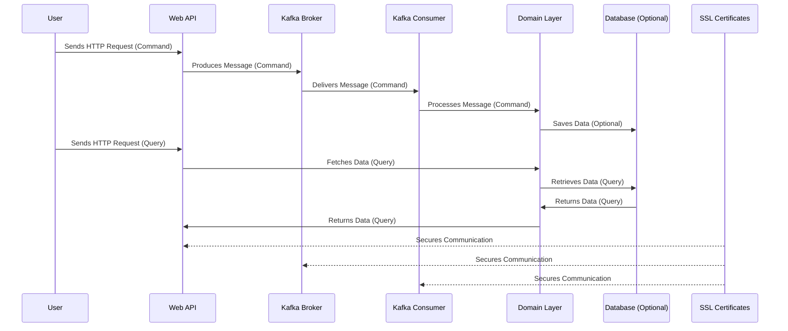

# Kafka Clean Architecture

This project is a .NET Core application that implements a clean architecture pattern with a focus on CQRS (Command Query Responsibility Segregation) and integrates with Kafka for messaging.

## System Architecture



## Project Structure

- **src**: Contains the main application code.
  - **Application**: Contains commands, queries, and interfaces.
    - **Commands**: Command implementations for modifying state.
    - **Queries**: Query implementations for retrieving data.
    - **Interfaces**: Interfaces for application services.
  - **Domain**: Contains the core domain entities and events.
    - **Entities**: Domain entities representing the business model.
    - **Events**: Domain events that signify changes in state.
  - **Infrastructure**: Contains implementations for external services.
    - **Kafka**: Kafka producer and consumer implementations.
    - **Persistence**: Database context for Entity Framework Core.
  - **WebApi**: Contains the Web API layer.
    - **Controllers**: API controllers for handling HTTP requests.

- **tests**: Contains unit tests for the application.
  - **Application.Tests**: Tests for application commands and queries.
  - **Domain.Tests**: Tests for domain entities.
  - **Infrastructure.Tests**: Tests for infrastructure components.

## Setup Instructions

1. Clone the repository:
   ```
   git clone <repository-url>
   cd KafkaCleanArchitecture
   ```

2. Restore the NuGet packages:
   ```
   dotnet restore
   ```

3. Update the configuration for Kafka in the `appsettings.json` file.

4. **Prepare Kafka with SSL**:
   - Ensure Docker is installed on your system.
   - Generate SSL certificates for Kafka:
```bash
mkdir kafka-secrets
# Generate a Private Key Run the following command to generate a private key:
openssl genrsa -out kafka-secrets/kafka.key 2048

# Generate a CSR using the private key:
openssl req -new -key kafka-secrets/kafka.key -out kafka-secrets/kafka.csr -subj "//CN=localhost"

# Create a self-signed certificate valid for 365 days:
openssl x509 -req -in kafka-secrets/kafka.csr -signkey kafka-secrets/kafka.key -out kafka-secrets/kafka.crt -days 365

# Convert the private key and certificate into a PKCS#12 keystore:
openssl pkcs12 -export -in kafka-secrets/kafka.crt -inkey kafka-secrets/kafka.key -out kafka-secrets/kafka.keystore.p12 -name kafka -password pass:kafka123

# Import the PKCS#12 Keystore into a Java Keystore
keytool -importkeystore -deststorepass kafka123 -destkeypass kafka123 -destkeystore kafka-secrets/kafka.keystore.jks -srckeystore kafka-secrets/kafka.keystore.p12 -srcstoretype PKCS12 -srcstorepass kafka123 -alias kafka

# Create a Truststore
keytool -import -trustcacerts -file kafka-secrets/kafka.crt -alias kafka -keystore kafka-secrets/kafka.truststore.jks -storepass kafka123 -noprompt

```

4. Start Kafka using Docker Compose: Ensure you have Docker installed, then run:
    ```
    docker compose down
    docker compose up -d
    docker-compose logs kafka
    ```
5. Run the application:
   ```
   dotnet run --project src/WebApi/WebApi.csproj
   ```

## Kafka SSL Demo


## Usage

- Use the API endpoints defined in `EntityController` to create and retrieve entities.
- The application uses Kafka for messaging, allowing for asynchronous processing of commands and events.

## Architecture

This project follows the Clean Architecture principles, separating concerns into different layers. The CQRS pattern is implemented to handle commands and queries distinctly, promoting a clear separation of responsibilities.

## Contributing

Contributions are welcome! Please submit a pull request or open an issue for any suggestions or improvements.